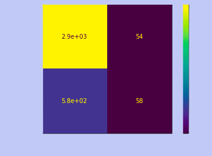

# 🚗 Waze Churn Prediction

A churn prediction analysis project using data from a fictional Waze-like navigation app. The goal is to identify potential churners and understand usage patterns using SQL and/or Python.

## 📌 Objective

Predict which users are likely to churn based on their activity history, engagement, and app usage.

## 🛠 Tools & Tech

- Python (Pandas, Matplotlib, Scikit-learn)
- Tableau
- Git & GitHub

## 📂 Project Structure
```bash
waze-churn-analysis/
├── data/ → Raw dataset CSVs
├── notebooks/ → logistic regression & tree based classification
├── visuals/ → Charts, graphs, screenshots
├── README.md → You're here
├── .gitignore 
```

## 🔍 Key Steps

- Data Cleaning & Transformation
- Exploratory Data Analysis (EDA)
- Feature Engineering
- Model Building 
- Final Insights & Recommendations

## 📊 Sample Insights

- Users who drive less than 5km/day have a 60% higher churn rate
- Weekend-only drivers are more loyal
- Churn peaks after new version rollouts

## 🖼 Visuals


## 1,LOGISITC REGRESSION OUTPUTS:

### LOGISIC REGRESSION CONFUSION MATRIX ACHIEVED F1 SCORE 9%:


<p align="center">
  
</p>


### LOGISTIC REGRESSION FEATURE IMPORTANCE BAR CHART:


### CHAMPION MODEL XG_BOOST  CONFUSION MATRIX ACHIEVED F1 SCORE 49%:


### XG_BOOST MODEL FEATURE IMPORTANCE BAR CHART:


## 💡 Conclusion

This analysis helps Waze teams identify at-risk users, optimize app features, and reduce churn.

## 🧠 Author

- Gokula Krishnan  
- [LinkedIn](https://www.linkedin.com/in/gokula-krishnan-senthilkumar-70a824212)  
- [Portfolio](https://gokulkrish1045.github.io/goku1045/)

